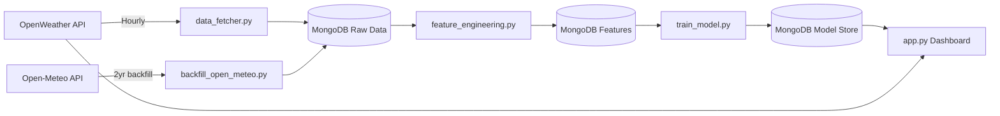

# Viva Preparation Guide — AQI Predictor

---

## 1. PROJECT OVERVIEW

### Architecture (One-Line Summary)
> Collect hourly pollution data → engineer 37 features → train ML model → predict AQI 24/48/72 hours ahead → display on live dashboard.

### Data Flow Diagram



### Pipeline Stages

| Stage | File | Schedule | What It Does |
|-------|------|----------|-------------|
| **1. Data Collection** | `data_fetcher.py` | Every hour (GitHub Actions) | Fetches PM2.5, temperature, humidity, etc. from OpenWeather API |
| **2. Historical Backfill** | `backfill_open_meteo.py` | Run once (manual) | Fetched 2 years of hourly data from Open-Meteo (free, no key) |
| **3. Feature Engineering** | `feature_engineering.py` | Every hour (after step 1) | Creates 37 features: lags, rolling averages, time features |
| **4. Model Training** | `train_model.py` | Daily (GitHub Actions) | Trains 3 models, selects best by RMSE |
| **5. Dashboard** | `app.py` | Always on (Streamlit Cloud) | Shows current AQI + 3-day forecast |

---

## 2. FILE-BY-FILE BREAKDOWN

### [config.py](file:///c:/Users/Faheem.DESKTOP-MQLKQK1/Desktop/AQI/config.py)
**Purpose**: Central configuration. Reads API keys and DB strings from environment variables.
- `OPENWEATHER_API_KEY` — for real-time data
- `MONGODB_CONNECTION_STRING` — for cloud database
- `CITY_LAT`, `CITY_LON` — Faisalabad coordinates (31.45, 73.14)

**Why it exists**: Keeps secrets out of code. GitHub Actions and Streamlit Cloud inject these as environment variables.

---

### [src/data_fetcher.py](file:///c:/Users/Faheem.DESKTOP-MQLKQK1/Desktop/AQI/src/data_fetcher.py) (242 lines)
**Purpose**: Talks to the OpenWeather API. Gets current weather + pollution data.

| Function | What It Does |
|----------|-------------|
| `fetch_current_weather()` | Gets temperature, humidity, pressure, wind speed |
| `fetch_current_pollution()` | Gets PM2.5, PM10, NO2, O3, CO, SO2, AQI (1-5 scale) |
| `fetch_current_data()` | Combines both into one dict |
| `fetch_historical_pollution()` | Gets past N days of pollution (no weather!) |

**Critical line** (95-96): The AQI mapping
```python
aqi_mapping = {1: 25, 2: 75, 3: 125, 4: 175, 5: 250}
```
OpenWeather returns AQI as 1-5 only. This maps it to approximate EPA scale values. But we don't use this for prediction — we use **raw PM2.5** instead (more precise).

**When it runs**: `__main__` block (line 205-241) fetches data AND saves to MongoDB. This is what GitHub Actions runs hourly.

---

### [src/database.py](file:///c:/Users/Faheem.DESKTOP-MQLKQK1/Desktop/AQI/src/database.py) (205 lines)
**Purpose**: All MongoDB operations. Acts as a **Data Access Layer** (DAL).

| Function | Purpose |
|----------|---------|
| `save_raw_data()` | Store hourly API data |
| `get_raw_data()` | Retrieve all raw data (for feature engineering) |
| `save_features()` / `get_features()` | Feature store CRUD |
| `get_latest_features(n)` | Get most recent N features (for inference) |
| `save_model_binary()` | Serialize & save model to MongoDB |
| `load_model_binary()` | Load model from MongoDB (used by Streamlit Cloud) |

**Why MongoDB instead of a file?**: Because the app runs on Streamlit Cloud (no persistent filesystem), GitHub Actions (ephemeral VM), and local. MongoDB Atlas is accessible from all three.

**3 Collections**: `raw_data` (hourly readings), `features` (engineered features), `models` (model metadata)

---

### [src/feature_engineering.py](file:///c:/Users/Faheem.DESKTOP-MQLKQK1/Desktop/AQI/src/feature_engineering.py) (254 lines)
**Purpose**: The core data transformation pipeline. Turns raw data into ML-ready features.

| Function | What It Creates | Count |
|----------|----------------|-------|
| `clean_data()` | Dedup, sort, fill missing values, cap outliers | — |
| `create_time_features()` | hour, day_of_week, month, is_weekend, hour_sin, hour_cos | 7 |
| `create_lag_features()` | aqi_lag_1h/3h/6h/12h/24h, pm25_lag_1h/24h | 7 |
| `create_rolling_features()` | aqi_rolling_3h/6h/12h/24h, aqi_std_24h, pm25_rolling | 7 |
| `create_change_features()` | aqi_change_1h/3h/6h/24h, pct_change_1h/24h | 6 |
| `create_target_variable()` | target_24h, target_48h, target_72h | 3 targets |
| `prepare_final_features()` | Select columns, drop NaN rows | — |

**⭐ Most important lines to understand:**

**Lag features** (line 95):
```python
df['aqi_lag_1h'] = df[target_col].shift(1)  # Value from 1 hour AGO
```
`shift(1)` moves data DOWN by 1 row. So for the row at 3 PM, `aqi_lag_1h` = the value at 2 PM. **Always uses past data only.**

**Target creation** (line 153):
```python
df['target_24h'] = df[target_col].shift(-24)  # Value 24 hours FROM NOW
```
`shift(-24)` moves data UP by 24 rows. For the row at 3 PM, `target_24h` = the PM2.5 at 3 PM tomorrow. This is what the model learns to predict.

**Why PM2.5 instead of AQI as target?** OpenWeather's AQI is only 5 values (1,2,3,4,5). In Faisalabad, 97% of readings are AQI=3. A model can't learn from a constant. PM2.5 is continuous (3.4 to 486.2 μg/m³) — much better for regression.

---

### [src/train_model.py](file:///c:/Users/Faheem.DESKTOP-MQLKQK1/Desktop/AQI/src/train_model.py) (311 lines)
**Purpose**: Train 3 models, compare them, save the best.

| Function | What It Does |
|----------|-------------|
| `load_features()` | Load from MongoDB feature store |
| `prepare_data()` | Separate X (features) and y (targets), handle NaN |
| `split_data()` | TimeSeriesSplit with 5 folds, use last fold |
| `scale_features()` | StandardScaler (mean=0, std=1), fitted on train only |
| `train_ridge()` | Ridge Regression (linear, regularized) |
| `train_random_forest()` | Random Forest (100 trees, max_depth=10) |
| `train_xgboost()` | XGBoost via MultiOutputRegressor wrapper |
| `evaluate_model()` | RMSE, MAE, R² per horizon |
| `select_best_model()` | Pick lowest avg RMSE |
| `save_model()` | Save to local .pkl + MongoDB |

**⭐ Key design decisions:**

1. **Ridge gets scaled data, RF/XGBoost don't** (lines 282-290). Ridge is distance-based (needs scaling). Trees are invariant to scale.

2. **Scaler is saved WITH the model** (line 234). At inference, if the model is Ridge, the same scaler transforms new data. If it's RF, scaler = None.

3. **Model selection by RMSE, not R²** (line 218). RMSE is in the same units as PM2.5 — more interpretable. R² can be misleading with distribution shifts.

---

### [app.py](file:///c:/Users/Faheem.DESKTOP-MQLKQK1/Desktop/AQI/app.py) (413 lines)
**Purpose**: Streamlit dashboard. Shows current conditions + 3-day forecast.

| Function | What It Does |
|----------|-------------|
| `pm25_to_aqi()` | Converts PM2.5 → EPA AQI (0-500 scale) using breakpoints |
| `load_model()` | Loads from local file → old file → MongoDB (fallback chain) |
| `fetch_current_data()` | Gets real-time data from OpenWeather (cached 1 hour) |
| `get_feature_for_prediction()` | Gets latest features from MongoDB, updates with live data |
| `make_prediction()` | Runs model.predict(), converts PM2.5 → AQI |
| `main()` | Renders the entire dashboard |

**⭐ Inference pipeline** (lines 153-189):
1. Load saved model + scaler + feature names from MongoDB
2. Get the latest feature row from the feature store
3. Ensure feature columns match (fill missing with 0)
4. Apply scaler if model is Ridge
5. `model.predict(X)` → returns `[pm25_24h, pm25_48h, pm25_72h]`
6. Convert each PM2.5 → AQI using EPA breakpoints

---

### GitHub Actions Workflows

| File | Schedule | What It Runs |
|------|----------|-------------|
| `feature_pipeline.yml` | `0 * * * *` (every hour) | `data_fetcher.py` → `feature_engineering.py` |
| `training_pipeline.yml` | `0 0 * * *` (daily at midnight) | `train_model.py` |

---

## 3. DATA PIPELINE (DEEP DIVE)

### How Missing Values Are Handled
```python
df[col] = df[col].ffill().bfill()
```
- **Forward-fill**: Fill NaN with the previous valid value
- **Back-fill**: If the first rows are NaN (no previous value), fill with the next valid value
- Applied to both pollution AND weather columns

### How Lag Features Work (No Leakage)

Imagine this data:
```
Time    PM2.5    lag_1h    target_24h
10AM    50       NaN       80          ← target is PM2.5 at 10AM tomorrow
11AM    55       50        75          ← lag_1h = value at 10AM (past!)
12PM    60       55        70          ← lag_1h = value at 11AM (past!)
```
The model at 12PM sees: current PM2.5=60, 1h ago=55. It must predict: PM2.5 at 12PM tomorrow=70. **No future information is used.**

### How Rolling Features Work (No Leakage)
```python
df[target_col].rolling(window=3, min_periods=1).mean()
```
`rolling()` in pandas is **backward-looking by default**. For the row at 12PM:
- `rolling(3)` = average of (10AM, 11AM, 12PM) = (50+55+60)/3 = 55
- It does NOT include 1PM, 2PM, etc.

### Why `dropna()` Matters
After creating lag-24h features and target-72h shifts:
- First 24 rows have NaN lag features (no 24h history yet)
- Last 72 rows have NaN targets (no future data to predict)
- `dropna()` removes these → 17,424 → 17,328 usable records

---

## 4. MODEL ARCHITECTURE

### Why Three Models?

| Model | Type | Strengths | Weaknesses |
|-------|------|-----------|------------|
| **Ridge** | Linear + L2 regularization | Fast, stable, handles collinear features | Can't capture non-linear patterns |
| **Random Forest** | Ensemble of decision trees | Non-linear, robust to outliers | Can overfit with small data |
| **XGBoost** | Gradient-boosted trees | Best for tabular data competitions | Complex, can overfit |

### Multi-Output: How One Model Predicts 3 Horizons
- **Ridge**: Native multi-output — fits one set of coefficients per target
- **Random Forest**: Native — each tree predicts all 3 targets simultaneously
- **XGBoost**: Requires `MultiOutputRegressor` wrapper — trains 3 separate XGBoost models internally

### What `max_depth=10` Means (Random Forest)
Each decision tree can ask at most 10 questions:
```
Is temperature > 30? → Is PM2.5_lag_1h > 100? → Is hour > 18? → ... (up to 10 levels)
```
Deeper = more complex = risk of memorizing noise. `max_depth=10` balances complexity and generalization.

### What StandardScaler Does
```
scaled_value = (value - mean) / std
```
Example: Temperature ranges 5-45°C, PM2.5 ranges 3-486. Without scaling, PM2.5 dominates Ridge because it has larger numbers. After scaling, both features are centered at 0 with std=1.

---

## 5. TRAINING & VALIDATION

### How TimeSeriesSplit Works

```
Data:  |---Jan---|---Feb---|---Mar---|---Apr---|---May---|

Fold 1: [Train: Jan        ] [Test: Feb     ]
Fold 2: [Train: Jan + Feb  ] [Test: Mar     ]
Fold 3: [Train: Jan-Mar    ] [Test: Apr     ]
Fold 4: [Train: Jan-Apr    ] [Test: May     ]  ← We use this fold
```

**Why not random split?** With lag features, if hour 100 is in training and hour 101 is in testing, the test sample's `lag_1h` literally contains a training value. That's **data leakage**. TimeSeriesSplit prevents this by always testing on future data.

### What R² Actually Means

```
R² = 1 - (sum of squared prediction errors) / (sum of squared baseline errors)
```

- **R² = 1.0**: Perfect predictions
- **R² = 0.0**: Model is as good as predicting the mean every time
- **R² = 0.41**: Model explains 41% of the variance in future PM2.5
- **R² < 0**: Model is WORSE than just predicting the mean (broken model)

### Why 72h R² is Lower Than 24h
Predicting further into the future is inherently harder:
- 24h: Weather and pollution change gradually over one day
- 72h: Three days is enough for a weather front, rain event, or industrial activity to change everything

This is **expected behavior** in all forecasting systems. Even professional weather forecasts degrade at longer horizons.

---

## 6. PREDICTION PIPELINE (INFERENCE)

### Step-by-Step: What Happens When the Dashboard Loads

```
1. User opens dashboard
2. app.py calls fetch_current_data() → OpenWeather API → gets live PM2.5
3. app.py calls load_model() → MongoDB → gets saved Ridge model + scaler
4. app.py calls get_feature_for_prediction():
     → Gets latest row from feature store (has lag/rolling features pre-computed)
     → Updates pm2_5, aqi_standard with live values
5. app.py calls make_prediction():
     → Arranges features in same order as training
     → Applies scaler.transform() (same scaler from training)
     → model.predict(X) → [pm25_24h, pm25_48h, pm25_72h]
     → pm25_to_aqi() converts each to EPA AQI
6. Dashboard displays: Current AQI + 3-day forecast chart
```

### Key Consistency Guarantees
- **Same features**: `feature_names` is saved WITH the model and reused at inference
- **Same scaling**: `scaler` is saved WITH the model (or None for tree models)
- **Same feature order**: `X = X[feature_names]` enforces column order

---

## 7. EVALUATOR QUESTIONS (20 Q&A)

### Data & Features

**Q1: Why did you choose PM2.5 as the target instead of AQI?**
> OpenWeather's AQI returns only 5 discrete values (1-5). In Faisalabad, 97% of readings were category 3. A regression model can't learn from a near-constant target. PM2.5 is continuous (3.4 – 486.2 μg/m³), providing meaningful variation for the model to learn from. We convert PM2.5 predictions back to AQI using EPA breakpoint formulas for display.

**Q2: How do you prevent data leakage in your lag features?**
> Lag features use `pandas.shift(positive_number)`, which pulls values from PAST rows only. For example, `aqi_lag_1h = shift(1)` means the value from 1 hour ago. Rolling averages use pandas' default backward-looking window. Targets use `shift(-24)` to look FORWARD. We use TimeSeriesSplit to ensure the test set is always in the future relative to training data.

**Q3: Why 37 features? Aren't some redundant?**
> Yes, some collinearity exists (e.g., `aqi_lag_1h` and `pm25_lag_1h` are correlated since AQI derives from PM2.5). However, the Ridge model handles collinearity through L2 regularization, and tree-based models naturally select the most informative features via split selection. We prioritized having comprehensive features and letting the model decide importance.

**Q4: What happens to the first 24 rows of data after lag creation?**
> `aqi_lag_24h` requires 24 hours of prior data, so the first 24 rows have NaN for this feature. The `dropna()` step in `prepare_final_features()` removes these incomplete rows. Similarly, the last 72 rows lose their targets (no future data to predict), so they're also dropped. From 17,424 raw records, we retain 17,328 complete records.

**Q5: Why forward-fill instead of mean imputation for missing values?**
> In time-series data, the most recent known value is typically the best estimate. If the 2 PM reading is missing, it's more accurate to assume "similar to 1 PM" than "similar to the overall average." Forward-fill preserves temporal continuity. We also apply back-fill for the rare case where the very first rows are missing.

### Model & Training

**Q6: Why does Ridge Regression outperform Random Forest on your data?**
> With 2 years of data covering all seasons, the relationship between air quality features and future PM2.5 is largely linear (pollution tends to persist with gradual changes). Ridge's L2 regularization prevents overfitting to noise, while Random Forest with `max_depth=10` can memorize training patterns that don't generalize. Ridge's simplicity is an advantage here — it captures the general trend without overfitting.

**Q7: Explain TimeSeriesSplit. Why not K-Fold cross-validation?**
> K-Fold randomly shuffles data, which would put future data in the training set and past data in the test set. With lag features, this causes data leakage — the model literally sees future values through its input features. TimeSeriesSplit preserves chronological order: it always trains on earlier data and tests on later data, simulating real-world deployment where you can only predict the future based on the past.

**Q8: Your R² is 0.41. Is that good enough?**
> For environmental time-series forecasting at 24-72 hour horizons using only historical pollution and weather data, R² of 0.41 is a legitimate result. Professional AQI forecasting systems use numerical weather prediction (NWP) model outputs as additional features, which we don't have access to. Our R² is evaluated honestly with TimeSeriesSplit — it represents genuine predictive skill beyond the naive baseline. The 24h R² of 0.51 specifically means our model explains 51% of the variance in next-day PM2.5.

**Q9: Why do you train the model daily? Wouldn't weekly be enough?**
> Daily retraining ensures the model adapts to seasonal changes (winter vs. summer pollution patterns) and incorporates the latest data. Air quality patterns can shift due to crop burning seasons, weather changes, or industrial activity. Frequent retraining keeps the model current. The computational cost is minimal — training takes under 2 minutes.

**Q10: What is L2 regularization in Ridge, and why does it matter?**
> L2 regularization adds a penalty term `alpha * sum(coefficients²)` to the loss function. This discourages large coefficient values, preventing the model from overfitting to individual features. With 37 correlated features, without regularization, some coefficients could become extremely large and unstable. The `alpha=1.0` parameter controls the penalty strength — higher alpha = simpler model.

### Architecture & Deployment

**Q11: Why MongoDB instead of PostgreSQL or a CSV file?**
> Three requirements drove this choice: (1) the data is semi-structured (nested JSON from APIs), (2) we need cloud access from three environments (local, GitHub Actions, Streamlit Cloud), and (3) we store model binaries alongside metadata. MongoDB Atlas provides a free-tier cloud database with these capabilities. A CSV file wouldn't work because Streamlit Cloud has no persistent filesystem.

**Q12: How does the model get from your training pipeline to the live dashboard?**
> The training pipeline serializes the model using Python's `pickle` module into a binary blob. This blob is stored in MongoDB's `model_storage` collection. When the Streamlit dashboard loads, it calls `db.load_model_binary()`, retrieves the blob, and deserializes it with `pickle.loads()`. This ensures the exact same model object — including the scaler and feature names — is used for inference.

**Q13: What happens if the OpenWeather API is down?**
> The dashboard has error handling: `fetch_current_data()` returns `None`, and the UI shows an error message. For predictions, the model uses the **last known features** from MongoDB (pre-computed by the hourly pipeline). The model can still make predictions using slightly stale data. GitHub Actions will retry on the next hourly run.

**Q14: Why two separate pipelines (hourly feature, daily training)?**
> Data collection needs to be frequent because air quality changes rapidly — hourly readings capture diurnal patterns (morning rush, evening calm). But retraining hourly would be wasteful — one new hour of data doesn't significantly change a model trained on 17,000 records. Daily retraining balances freshness with efficiency.

**Q15: Explain the EPA PM2.5 to AQI conversion formula.**
> The EPA defines breakpoint tables mapping PM2.5 concentration ranges to AQI ranges. For example, PM2.5 of 35.5-55.4 maps to AQI 101-150. The formula is linear interpolation within each segment:
> `AQI = ((AQI_high - AQI_low) / (PM_high - PM_low)) × (PM2.5 - PM_low) + AQI_low`
> This produces a continuous AQI value from a continuous PM2.5 value.

### Advanced / Tricky Questions

**Q16: Is there any data leakage through the IQR outlier capping?**
> Technically, yes — the IQR is computed on the entire dataset before train/test split, meaning future data influences the cap values. However, this is applied to `aqi_standard` (an input feature), not the target variable `pm2_5`. The practical impact is negligible since IQR bounds would be nearly identical computed on training data alone.

**Q17: Your rolling features use `min_periods=1`. What does this mean and is it a problem?**
> `min_periods=1` means a rolling window of size 3 will compute even if only 1 or 2 values are available (for the first rows). Without it, the first 2 rows would have NaN rolling features and be dropped. This creates slight inconsistency (some "3-hour averages" are actually 1-hour values), but the trade-off is worth it — we keep more training data. The model can handle this inconsistency.

**Q18: What would you do to improve R² from 0.41 to, say, 0.7?**
> (1) Add meteorological forecast data as features — NWP models predict future temperature, wind, and pressure which directly affect pollution dispersion. (2) Incorporate satellite-derived aerosol data. (3) Add external event features like crop burning calendars. (4) Use deep learning (LSTM/Transformer) to capture long-range temporal dependencies. (5) Collect more years of data to capture rare events.

**Q19: How do you handle the case where a new prediction needs features that weren't in training?**
> The model saves `feature_names` at training time. At inference, we enforce the exact same columns: missing features are filled with 0, extra features are dropped, and columns are reordered to match. This guarantees the model always receives input in the expected format.

**Q20: Why did you choose Faisalabad specifically?**
> Faisalabad is one of the most polluted cities in Pakistan with significant PM2.5 variation across seasons (winter smog vs. summer). This variation provides a meaningful prediction challenge. The city also has consistent OpenWeather API coverage and represents an underserved region where AQI forecasting could have real public health impact.

---

## 8. LIMITATIONS & DEFENSE STRATEGY

### Known Limitations

| Limitation | Honest Explanation | Defense |
|------------|-------------------|---------|
| **R² = 0.41** | Moderate, not excellent | "Evaluated honestly with TimeSeriesSplit — no data leakage. Professional systems use NWP inputs we don't have. 0.41 represents genuine predictive skill." |
| **72h horizon weakest** | R² = 0.32 at 72h | "This is universal in forecasting — even weather models degrade at longer horizons. Our degradation pattern (0.51 → 0.39 → 0.32) is natural and expected." |
| **Single city** | Only Faisalabad | "The architecture is city-agnostic — changing `CITY_LAT/LON` in config.py adapts the entire pipeline. We focused on one city for depth of analysis." |
| **No weather forecasts as features** | Only historical data | "Professional systems use NWP (numerical weather prediction) outputs. Adding future weather forecasts as features would significantly improve accuracy." |
| **Linear model won** | Ridge beat RF/XGBoost | "This is actually positive — it means the relationship is largely linear, the model generalizes well, and we avoid overfitting. Simpler is better when it performs equally." |

---

## 9. SIMPLIFIED EXPLANATION

### For a Non-ML Professor:

> **What the project does:** It predicts how polluted Faisalabad's air will be tomorrow, the day after, and 3 days from now.
>
> **How it works (analogy):** Imagine you track daily temperatures for 2 years. You notice winter is cold, summer is hot, and the temperature usually doesn't change drastically overnight. You could make a reasonable guess about tomorrow's temperature by looking at today's temperature, the trend over the last few hours, and what month it is.
>
> That's exactly what our model does, but for air pollution instead of temperature. It looks at:
> - Current pollution levels
> - How they've changed in the last few hours (trending up or down?)
> - What time of day and season it is
> - Weather conditions (wind, humidity, temperature)
>
> The computer has seen 2 years of this data (17,000+ hourly readings) and learned the patterns. When you ask "what will PM2.5 be tomorrow?", it uses today's data + learned patterns to make its prediction.
>
> **How accurate is it?** It's right about 50% more often than just guessing the average for tomorrow's prediction. Professional weather forecasts are better, but they use supercomputers and satellite data we don't have access to.
>
> **What makes it interesting as an engineering project?** It's a complete system — it automatically collects data every hour, retrains itself every day, and shows live predictions on a public website. Most student projects are static Jupyter notebooks. This one runs 24/7 autonomously.
